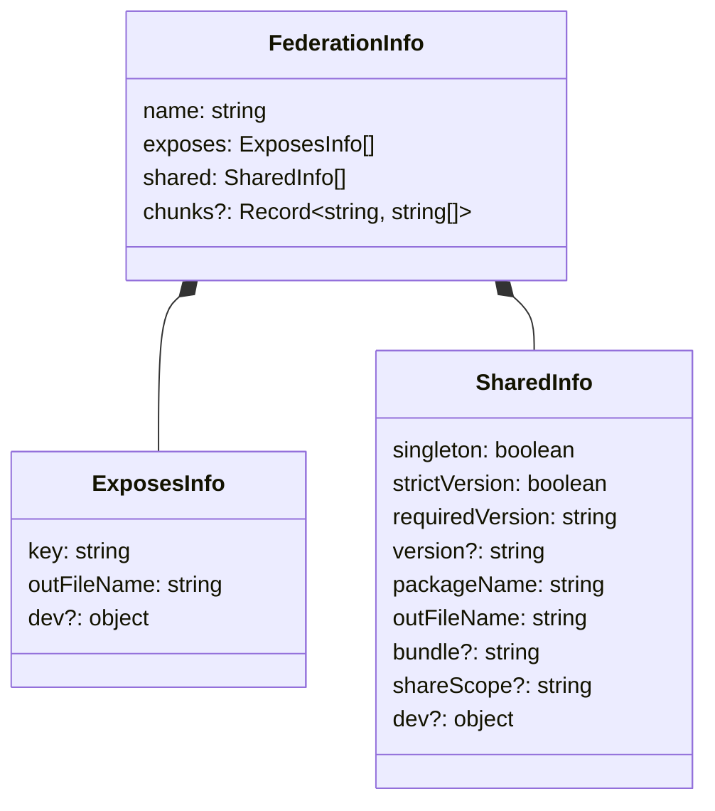
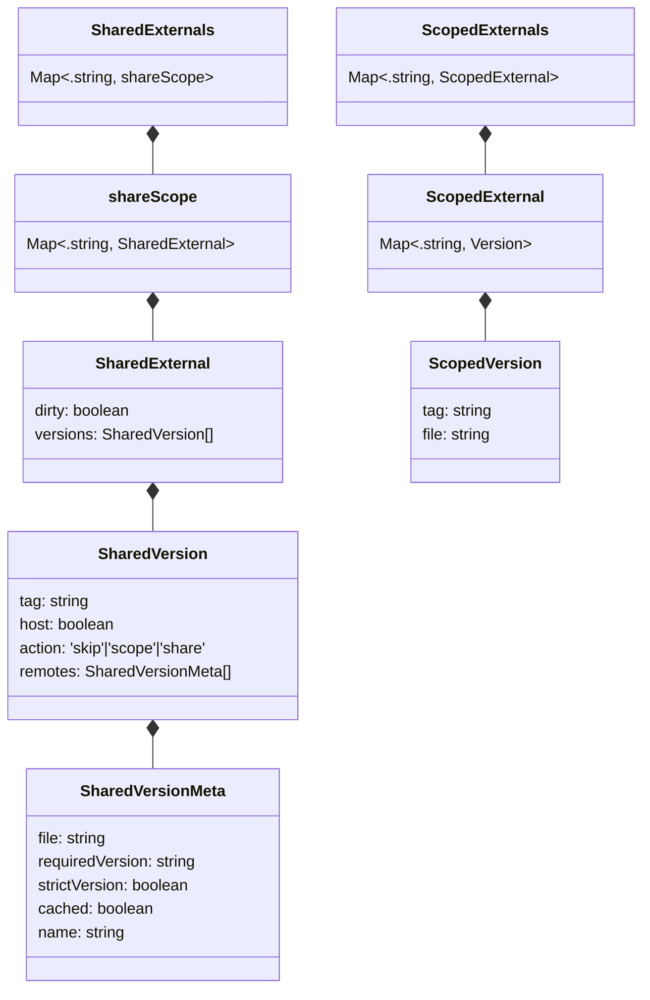

[< back](./../README.md)

# Native Federation Architecture

`vanilla-native-federation` is a runtime orchestration library that enables micro frontends to be dynamically loaded and integrated into HTML pages. The library manages dependency resolution, module discovery, and module loading to create a unified application from independently deployed micro frontends.

## Core Problem and Solution

**Problem**: Server-side rendered applications (PHP, Ruby, Java, ASP.NET) need to integrate micro frontends that are built and deployed independently by different teams, while optimizing shared dependencies and avoiding version conflicts.

**Solution**: `vanilla-native-federation` provides a runtime system that:

- Discovers available micro frontends through manifest files
- Resolves dependency conflicts automatically using semantic versioning
- Generates optimized import maps for efficient browser loading
- Enables on-demand component loading with a simple API

## System Overview

The library implements a multi-stage orchestration process to integrate distributed micro frontends:


**In simple terms:**

1. Your website asks "What micro frontends can I use?"
2. Each micro frontend says "Here's what I offer and what I need"
3. The orchestrator figures out the most efficient way to load the remotes
4. Components are loaded on-demand when needed

## Key Concepts

### 1. Manifest - The Service Directory

The **manifest** serves as a registry that maps "remote" (micro frontend) names to their remoteEntry.json (metadata file) locations:

```json
{
  "shopping-cart": "https://ecommerce-team.com/remoteEntry.json",
  "user-profile": "https://user-team.com/remoteEntry.json",
  "payment-widget": "https://payments-team.com/remoteEntry.json"
}
```

This enables decentralized deployment and management of micro frontends and provides a central place to discover and fetch the latest versions of all the micro frontends.

### 2. RemoteEntry - The Component Metadata

Each micro frontend provides a **remoteEntry.json** file that describes its available components and dependencies:

```json
{
  "name": "shopping-cart",
  "exposes": [
    { "key": "./CartButton", "outFileName": "cart-button.js" },
    { "key": "./CartSummary", "outFileName": "cart-summary.js" }
  ],
  "shared": [
    {
      "packageName": "react",
      "version": "18.2.0",
      "requiredVersion": "^18.0.0",
      "singleton": true
    }
  ]
}
```

**Specification:**

- **name**: The name of the remote
- **exposes**: Available components for consumption
- **shared**: Dependencies that can be shared with other micro frontends, also referred to as "externals".

### 3. Optimized Dependency Resolution

The system optimizes dependency sharing across multiple remotes/micro frontends. Consider three teams with React requirements:

- **Team A**: Requires React 18.2.0
- **Team B**: Requires React 18.1.0
- **Team C**: Requires React 17.0.0 (legacy system)

The resolution process:

1. **Compatibility Analysis**: Determines version compatibility between requirements
2. **Optimal Version Selection**: Chooses React 18.2.0 for shared use (Teams A and B)
3. **Incompatible Version Handling**: Provides scoped React 17.0.0 for Team C

**Outcome**: Two downloads instead of three, optimizing bandwidth and load time.

> Read more about dependency resolving [here](./version-resolver.md)

## Understanding the domain

The following sections detail the specific data formats and structures used throughout Native Federation.


### Manifest.json

The manifest serves as the entry point, mapping micro frontend names to their metadata locations. The manifest enables runtime discovery and supports environment-specific deployments without recompilation.

```json
{
  "team/mfe1": "https://example.org/mfe1/remoteEntry.json",
  "team/mfe2": "https://example.org/mfe2/remoteEntry.json"
}
```

The directory containing the remoteEntry.json file (`https://example.org/mfe1/` in this example) becomes the "scope" for that micro frontend. All JavaScript ESM URLs are resolved relative to this scope, and scoped dependencies use this path as their namespace in the import map.

### RemoteEntry.json

The remoteEntry.json file contains comprehensive metadata about a micro frontend's capabilities and requirements. This metadata drives the entire orchestration process.



> **Note**: The optional `chunks` property enables [dense chunking](./dense-chunking.md), a feature that reduces remoteEntry.json file sizes by storing internal chunks more efficiently. The `bundle` property links each external to its bundle for chunk lookup.

#### Example RemoteEntry.json

```json
{
  "name": "team/remote1",
  "exposes": [{ "key": "./comp-a", "outFileName": "component-a.js" }],
  "shared": [
    {
      "version": "1.2.3",
      "requiredVersion": "~1.2.1",
      "strictVersion": false,
      "singleton": true,
      "packageName": "dep-a",
      "outFileName": "dep-a.js"
    },
    {
      "version": "4.5.6",
      "requiredVersion": "^4.1.1",
      "strictVersion": true,
      "singleton": false,
      "packageName": "dep-b",
      "outFileName": "dep-b.js"
    }
  ]
}
```

#### Shared External Properties

| Property        | Description                                                                                                                                                       |
| --------------- | ----------------------------------------------------------------------------------------------------------------------------------------------------------------- |
| version         | The actual version of the dependency provided by this micro frontend                                                                                              |
| requiredVersion | Version range this micro frontend is compatible with (enables clustering)                                                                                         |
| strictVersion   | Will make sure the remote receives a compatible version when the external is shared, even if that means loading multiple versions of the dependency               |
| singleton       | Allows the dependency to be shared and used by other remotes that need it.                                                                                        |
| shareScope      | Allows for sharing dependencies in a specific group instead of globally, allowing for clusters of shared externals. the `"strict"` shareScope is a special scope. |
| packageName     | Dependency identifier for resolution                                                                                                                              |
| outFileName     | File path relative to the micro frontend's scope                                                                                                                  |
| dev             | Optional development configuration containing entryPoint information                                                                                              |

### Understanding the stored remoteEntries

After processing the remoteEntry.json files, the library stores the shared components and dependencies in memory to be used when the importMap is generated:

> exposed on `import * from 'vanilla-native-federation/sdk'`

#### Remote Information Cache


Think of this as a local directory of available components:

```javascript
// What gets stored for each micro frontend
{
    "shopping-cart": {
        scopeUrl: "https://ecommerce-team.com/",
        exposes: [
            { moduleName: "./CartButton", file: "cart-button.js" },
            { moduleName: "./CartSummary", file: "cart-summary.js" }
        ]
    }
}
```

When `loadRemoteModule("shopping-cart", "./CartButton")` is called, the system references this cached information to locate the exact resource.

#### External Dependencies Cache

Dependencies are categorized into two types based on their singleton property. `true` => `SharedExternal` and `false` => `ScopedExternal`:



#### Example Cached Externals

The action field is calculated during the dependency resolution phase:

```json
{
  "shared-externals": {
    "__GLOBAL__": {
      "dep-a": {
        "dirty": false,
        "versions": [
          {
            "tag": "1.2.3",
            "host": false,
            "action": "share",
            "remotes": [
              {
                "file": "dep-a.js",
                "name": "team/mfe1",
                "requiredVersion": "~1.2.1",
                "strictVersion": false,
                "cached": true
              },
              {
                "file": "dep-a.js",
                "name": "team/mfe2",
                "requiredVersion": "~1.2.1",
                "strictVersion": false,
                "cached": false
              }
            ]
          },
          {
            "tag": "1.2.2",
            "host": false,
            "action": "skip",
            "remotes": [
              {
                "file": "dep-a.js",
                "name": "team/mfe2",
                "requiredVersion": "^1.2.1",
                "strictVersion": true,
                "cached": false
              }
            ]
          }
        ]
      }
    },
    "custom-scope": {
      "dep-c": {
        "dirty": false,
        "versions": [
          {
            "tag": "1.2.4",
            "host": false,
            "action": "share",
            "remotes": [
              {
                "file": "dep-c.js",
                "name": "team/mfe1",
                "requiredVersion": "~1.2.1",
                "strictVersion": false,
                "cached": true
              }
            ]
          },
          {
            "tag": "1.2.3",
            "host": false,
            "action": "skip",
            "remotes": [
              {
                "file": "dep-c.js",
                "name": "team/mfe2",
                "requiredVersion": "~1.2.1",
                "strictVersion": false,
                "cached": false
              }
            ]
          }
        ]
      }
    }
  },
  "scoped-externals": {
    "https://example.org/mfe1/": {
      "dep-b": {
        "tag": "4.5.6",
        "file": "dep-b.js"
      }
    }
  }
}
```

### Generated Import Map

The final import map provides the browser with optimized module resolution instructions:

```json
{
  "imports": {
    // Shared components
    "shopping-cart/./CartButton": "https://ecommerce-team.com/cart-button.js",
    "shopping-cart/./CartSummary": "https://ecommerce-team.com/cart-summary.js",

    // Shared externals
    "dep-a": "https://example.org/mfe1/dep-a.js"
  },
  "scopes": {
    // Scoped externals
    "https://example.org/mfe1/": {
      "dep-b": "https://example.org/mfe1/dep-b.js",
      "dep-c": "https://example.org/mfe1/dep-c.js"
    },
    "https://example.org/mfe2/": {
      "dep-c": "https://example.org/mfe1/dep-c.js"
    }
  }
}
```

This structure enables:

- **Global sharing** via the imports object (dep-a downloads once, used everywhere compatible)
- **Scoped isolation** via the scopes object (dep-b only loads for its specific micro frontend)
- **Grouped externals** Reusing compatible externals with the same `shareScope` to minimize downloads even more!
- **Optimal caching** through strategic version selection and reuse

## Caching and Performance

### Storage Options

If configured, the browser can remember and prioritize shared externals utilizing browser storage options:

| Storage Type         | Lifetime         | Best For                                          |
| -------------------- | ---------------- | ------------------------------------------------- |
| **Memory** (default) | Single page load | Development, testing                              |
| **Session Storage**  | Browser session  | Multi-page websites                               |
| **Local Storage**    | Persistent       | Aggressive caching over multiple browser sessions |

### Optimization Strategies

1. **Skip Cached Remotes**: Don't re-fetch metadata for known micro frontends
2. **Reuse Resolved Dependencies**: Remember which versions were chosen
3. **Prioritize Host Versions**: Give preference to host-specified dependency versions
4. **Minimize Downloads**: Choose versions that maximize sharing

> Read more about configuration options [here](./config.md)

## Implementation Example

Consider an e-commerce site with distributed team ownership:

```html
<!-- Your main page -->
<script type="application/json" id="mfe-manifest">
  {
    "product-catalog": "https://catalog-team.com/remoteEntry.json",
    "shopping-cart": "https://cart-team.com/remoteEntry.json",
    "user-account": "https://account-team.com/remoteEntry.json"
  }
</script>
```

**Execution Flow:**

1. **Manifest Processing**: System discovers 3 micro frontends
2. **Metadata Collection**: Each team provides component and dependency information
3. **Dependency Resolution**: All teams can reuse shared dependencies like React.
4. **Import Map Generation**: Browser receives optimized loading instructions
5. **Runtime**: Components become available via `loadRemoteModule()` and can be imported on demand (lazy).

**Architectural Benefits:**

- ✅ Independent team deployment cycles
- ✅ Shared dependencies download once
- ✅ Minimal inter-team coordination required
- ✅ Automatic performance optimization

## Configuration Impact

Different configuration options change how the system behaves:

```javascript
// Conservative approach - maximize safety
{
    strict: true,                    // Fail on version conflicts
    profile: { latestSharedExternal: false }, // Optimize for compatibility
    storage: sessionStorage          // Remember across pages
}

// Aggressive approach - maximize performance
{
    strict: false,                   // Warn but continue on conflicts
    profile: { latestSharedExternal: true },  // Always use latest versions
    storage: localStorage            // Remember across sessions
}
```

> Read more about configuration options [here](./config.md)
