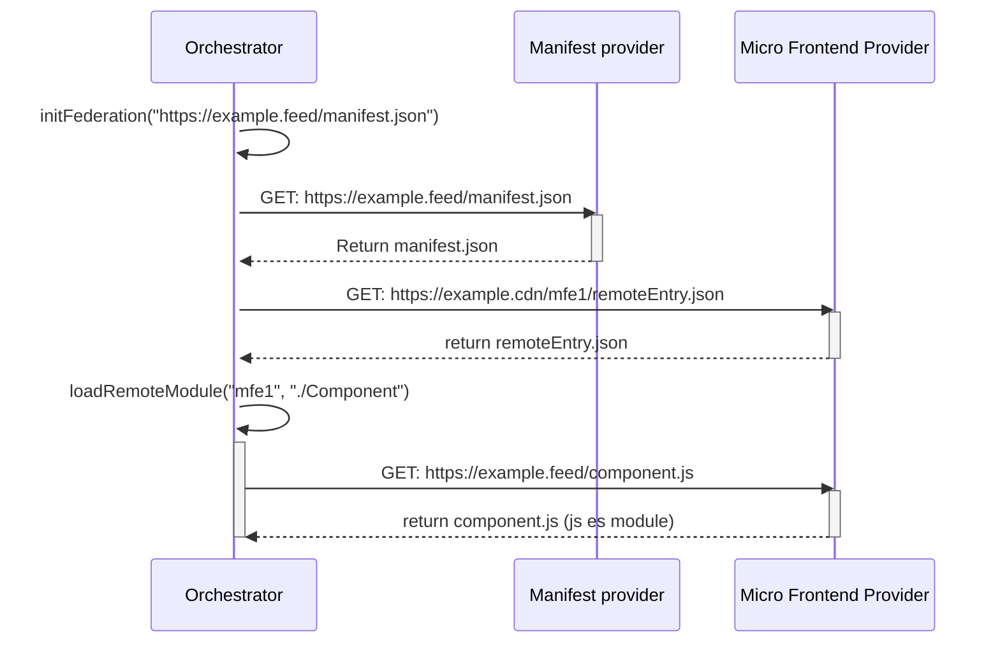
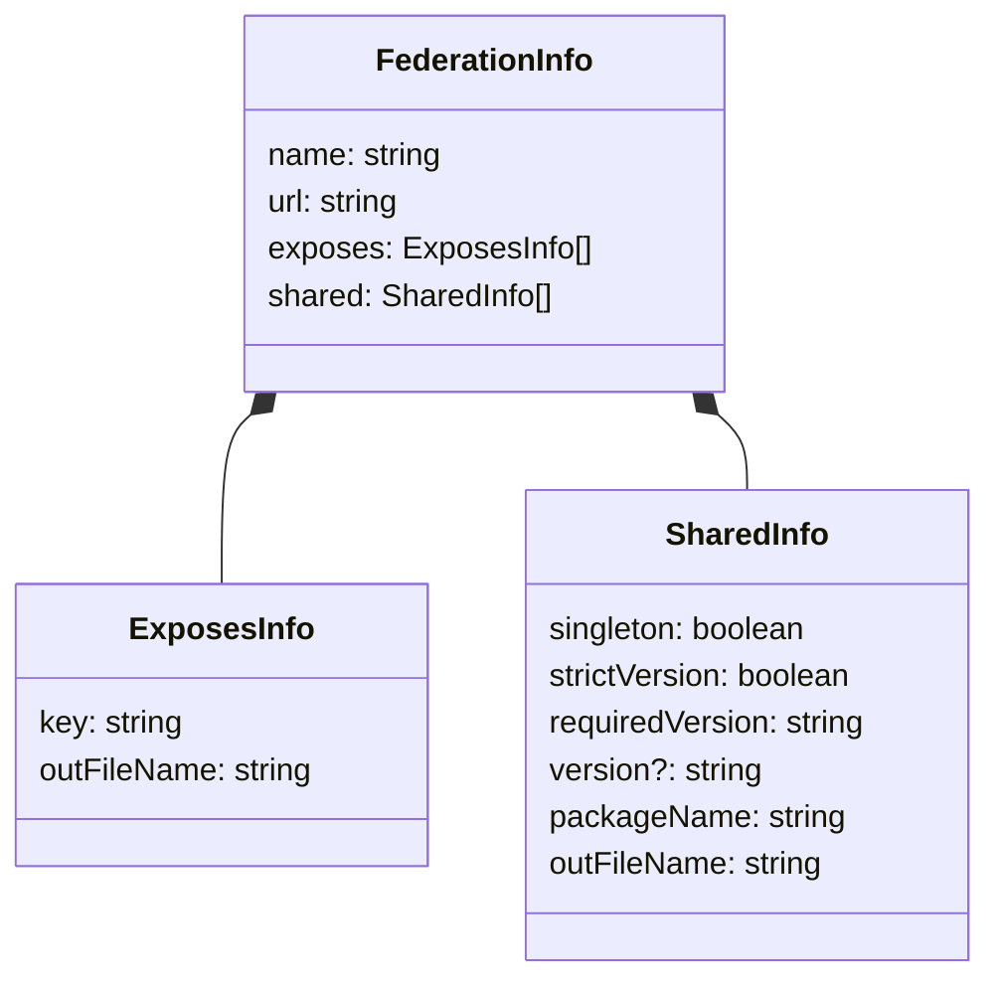

# The native-federation domain

The native-federation domain defines the models and entities being processed and stored by the `vanilla-native-federation` library. As seen in the sequence diagram below, the first step is to fetch the manifest JSON, it is entirely possible to provide a hardcoded manifest object instead. The following step is to fetch the metadata files (remoteEntry.json) which contain the exposed modules and required extenals (dependencies). Finally, the library processes and stores the metadata to be used during the `loadRemoteModule` step. 



## RemoteEntry.json

The `remoteEntry.json` is a remote's metadata file. It is fetched by the native-federation adapter and processed to be stored in cache. The  metadata files contain a mapping of the required externals and exposed modules. 

In the official native-federation library, the remoteEntry.json object is referred to as the `FederationInfo` object. In the vanilla-native-federation library it is mapped to the `RemoteInfo` object which contains the url of the `remoteEntry.json` file as well: 



An example of an expected `remoteEntry.json` can be seen below. A remote can contain multiple exposed modules. A module refers to a JavaScript ES Module file hosted on an external location: 

```json
{
    "name": "team/mfe1",
    "exposes": [
        { "key": "./wc-comp-a",  "outFileName": "component-a.js" }
    ],
    "shared": [
        {
            "version": "1.2.3", 
            "requiredVersion": "~1.2.1", 
            "strictVersion": false,
            "singleton": true,
            "packageName": "dep-a",
            "outFileName": "dep-a.js"
        },
        {
            "version": "4.5.6", 
            "requiredVersion": "^4.1.1", 
            "strictVersion": true,
            "singleton": false,
            "packageName": "dep-b",
            "outFileName": "dep-b.js"
        }
    ]
}
```

### SharedExternal

The `sharedExternal` contains a library that can be shared based on provided metadata: 

| Option | Description |
| --- | --- |
| version | The version of the dependency. |
| requiredVersion | The version range that this dependency is compatible with. This allows native-federation to cluster compatible dependencies into a single external potentially preventing redundant downloads | 
| strictVersion | Whenever the external is marked as singleton and strictVersion, it forces the library to resolve the external version if incompatible with (cached) other versions of the target external. When disabled, native-federation will only throw a warning when the version is incompatible. |
| singleton | Mark the external as singleton/shared, thus allowing native-federation to reuse this version over multiple remotes. |
| packageName | The name of the external |
| outFileName | The filename of the external, relative from the location of the remoteEntry.json |

**todo** refer to the sharing versions section.