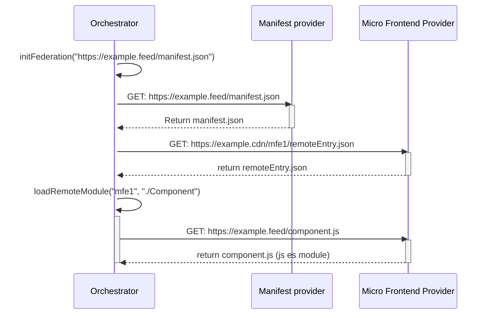
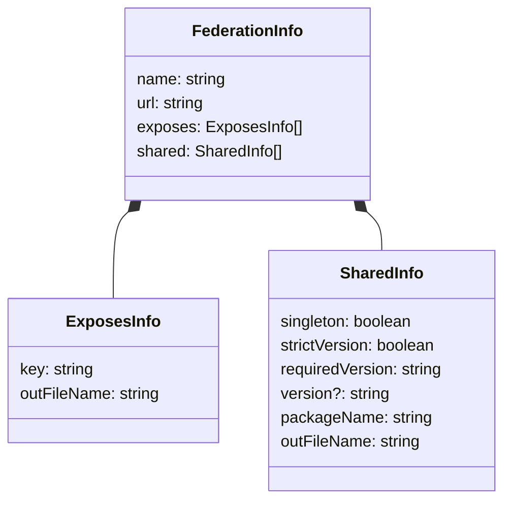
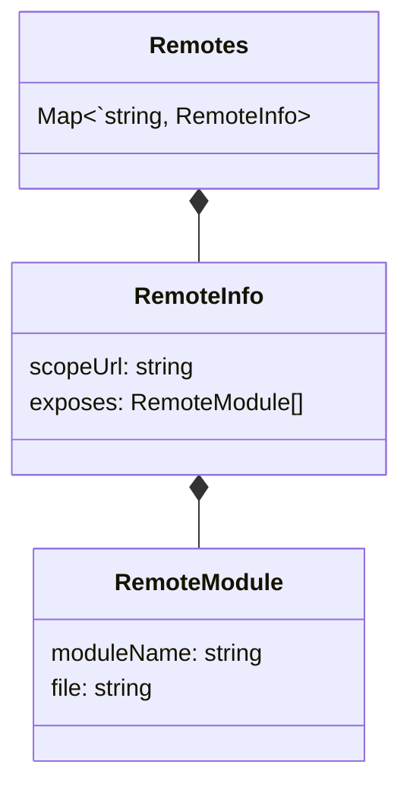
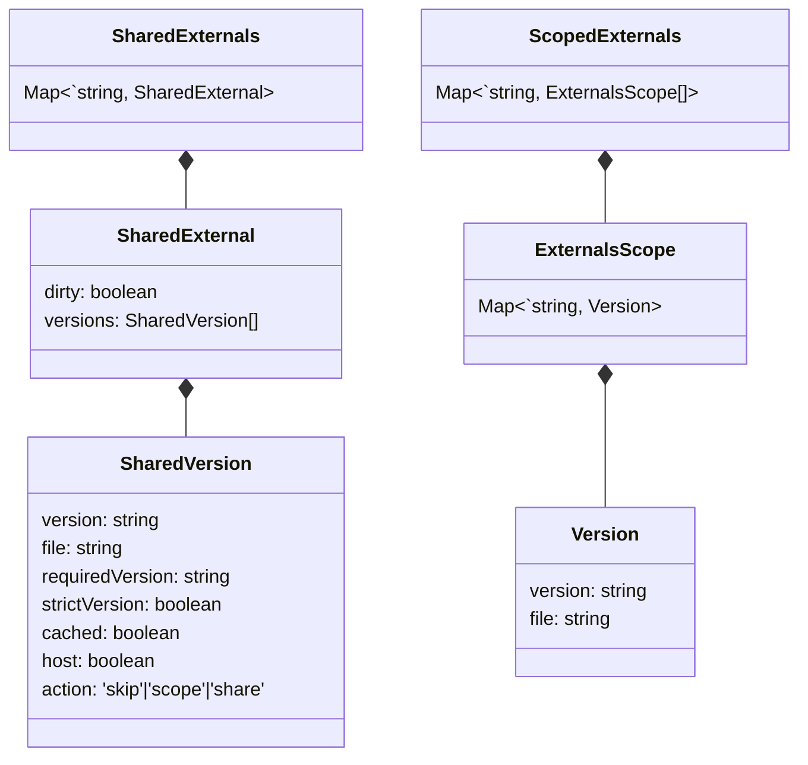

[< back](./../README.md)

# The native-federation domain

The native-federation domain defines the models and entities being processed and stored by the `vanilla-native-federation` library. As seen in the sequence diagram below, the first step is to fetch the manifest JSON, it is entirely possible to provide a hardcoded manifest object instead. The following step is to fetch the metadata files (remoteEntry.json) which contain the exposed modules and required externals (dependencies) per remote. Finally, the library processes and stores the metadata to be used during the `loadRemoteModule` step. 



## Manifest.json

The `manifest.json` is a Map containing the available remotes as keys, and the location of their respective remoteEntry.json as values. The manifest tells `native-federation` what remotes to initialize and where to find the metadata. An example can be seen below:

```json
{
    "team/mfe1": "https://example.org/mfe1/remoteEntry.json",
    "team/mfe2": "https://example.org/mfe2/remoteEntry.json" 
}
```

The folder in which the remoteEntry is located (`https://example.org/mfe1/` in the case of `team/mfe1`) is used as the "scope" of the remote, all JavaScript ESM urls are assumed to be calculated with the scope as root folder. Whenever an external is defined as scoped (`singleton: false`), the scope is used as reference point in the importmap. A detailed explanation of scopes in importmaps can be found [here](https://developer.mozilla.org/en-US/docs/Web/HTML/Reference/Elements/script/type/importmap).

## RemoteEntry.json

The `remoteEntry.json` is a remote's metadata file. It is fetched by the native-federation adapter and processed to be stored in cache. The  metadata files contain a mapping of the required externals and exposed modules. 

In the official native-federation library, the remoteEntry.json object is referred to as the `FederationInfo` object. In the vanilla-native-federation library it is mapped to the `RemoteInfo` object which contains the url of the `remoteEntry.json` file as well: 



An example of an expected `remoteEntry.json` can be seen below. A remote can contain multiple exposed modules. A module refers to a JavaScript ES Module file hosted on an external location: 

```json
{
    "name": "team/mfe1",
    "exposes": [
        { "key": "./wc-comp-a",  "outFileName": "component-a.js" }
    ],
    "shared": [
        {
            "version": "1.2.3", 
            "requiredVersion": "~1.2.1", 
            "strictVersion": false,
            "singleton": true,
            "packageName": "dep-a",
            "outFileName": "dep-a.js"
        },
        {
            "version": "4.5.6", 
            "requiredVersion": "^4.1.1", 
            "strictVersion": true,
            "singleton": false,
            "packageName": "dep-b",
            "outFileName": "dep-b.js"
        }
    ]
}
```

### SharedExternal

The `sharedExternal` contains the metadata for an external (dependency) that can be shared based on provided metadata: 

| Option | Description |
| --- | --- |
| version | The version of the dependency. |
| requiredVersion | The version range that this dependency is compatible with. This allows native-federation to cluster compatible dependencies into a single external potentially preventing redundant downloads | 
| strictVersion | Whenever the external is marked as singleton and strictVersion, it forces the library to resolve the external version if incompatible with (cached) other versions of the target external. When disabled, native-federation will only throw a warning when the version is incompatible. |
| singleton | Mark the external as singleton/shared, thus allowing native-federation to reuse this version over multiple remotes. |
| packageName | The name of the external |
| outFileName | The filename of the external, relative from the location of the remoteEntry.json |

> Read more about the version resolver [here](./version-resolver.md).

## Cache (RemoteInfo)

After fetching the `remoteEntry.json` files, the remotes are cached as `RemoteInfo` objects for reuse. A remote is essentially a key-value pair in the `Remotes` Map where the remoteName is the key and an object containing the `RemoteModule` objects and dedicated scope of the remote is the value.  



If the remote name is found in cache, the fetch of the `remoteEntry.json` is skipped to prevent redundant downloads.

## Cache (Externals)

The externals are the dependencies of the `RemoteModule`. Externals are divided into 2 categories: `ScopedExternals` and `SharedExternals` based on the property `singleton: true` defined in the External in the remote's `remoteEntry.json`. 



An example of the cached externals can be seen below, the action is calculated in the `determine-shared-externals` step during initialization. In the case below, the 2nd version of `dep-a` is being skipped since the 1st version is within the `requiredVersion` range of the 2nd version: 

```json
{
    "shared-externals": {
        "dep-a": [
            {
                "version": "1.2.3", 
                "file":"https://example.org/mfe1/dep-a.js",
                "requiredVersion": "~1.2.1", 
                "strictVersion": false,                
                "action": "share",
                "host": false,
                "cached": true
            },
            {
                "version":"1.2.2", 
                "file":"https://example.org/mfe2/dep-a.js",
                "requiredVersion": "^1.2.1", 
                "strictVersion": true, 
                "action": "skip",
                "host": false,
                "cached": false
            }
        ]
    },
    "scoped-externals": {
        "https://example.org/mfe1/": {
            "dep-b": {
                "version": "4.5.6", 
                "file":"dep-b.js",
            }
        }
    }
}
```

## ImportMap

Based on the cached externals above, an import map is being generated and added to the head of the HTML document: 

```
{
    "imports" {
        "dep-a": "https://example.org/mfe1/dep-a.js"
    }
    "scopes": {
        "https://example.org/mfe1/": {
            "dep-b": "https://example.org/mfe1/dep-b.js"
        }
    }
}
```