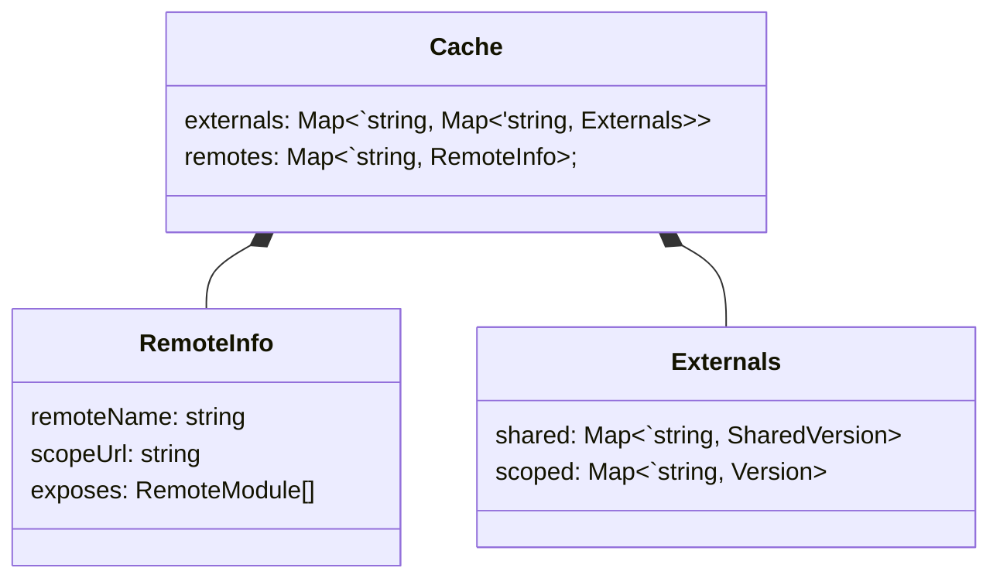

# Externals

The cache stores all initialized remotes and (shared) externals. 

## Aggregate

```mermaid
classDiagram
    Cache *-- RemoteInfo
    Cache *-- Externals

    class Cache {
        externals:  Map<`string, Map<'string, Externals>>
        remotes: Map<`string, RemoteInfo>; 
    }

    class RemoteInfo {
        remoteName: string
        scopeUrl: string
        exposes: RemoteModule[] 
    }

    class Externals {
        shared: Map<`string, SharedVersion>
        scoped: Map<`string, Version>
    }


```