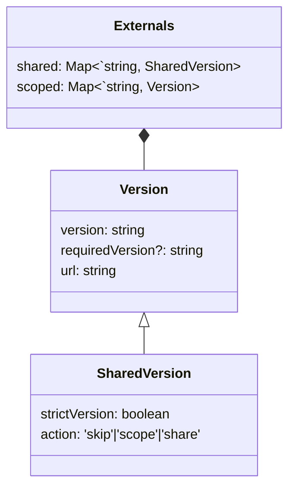

# Externals

The externals are shared dependencies over the initialized remotes. They are used as source to build up the ImportMap. 

## Aggregate

```mermaid
classDiagram
    Externals *-- Version
    Version <|-- SharedVersion

    class Externals {
        shared: Map<`string, SharedVersion>
        scoped: Map<`string, Version>
    }
    class Version{
        version: string
        requiredVersion?: string
        url: string
    }
    class SharedVersion{
        strictVersion: boolean
        action: 'skip'|'scope'|'share'
    }   
a

```