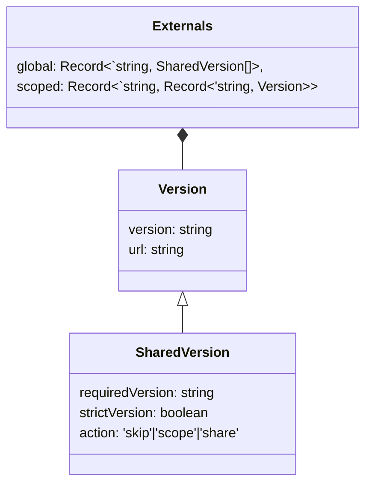

# Externals

The externals are shared dependencies over the initialized remotes. They are used as source to build up the ImportMap. 

## Aggregate



## Structure

```json
{
    "shared": {
        "depA": [
            {
                "version":"1.1.2", 
                "url":"http://url.to/example/depA.js",
                "requiredVersion": "~1.1.0", 
                "strictVersion": true, 
                "action": "share"
            },
            {
                "version":"1.0.1", 
                "url":"http://another.to/example/depA.js",
                "requiredVersion": "~1.0.0", 
                "strictVersion": true, 
                "action": "skip"
            }
        ]
    },
    "scoped": {
        "http://custom.url/scope": {
            "depB": {
                "version":"2.0.1", 
                "url":"http://another.url/scope/depB.js"
            }
        }
    }
}
```