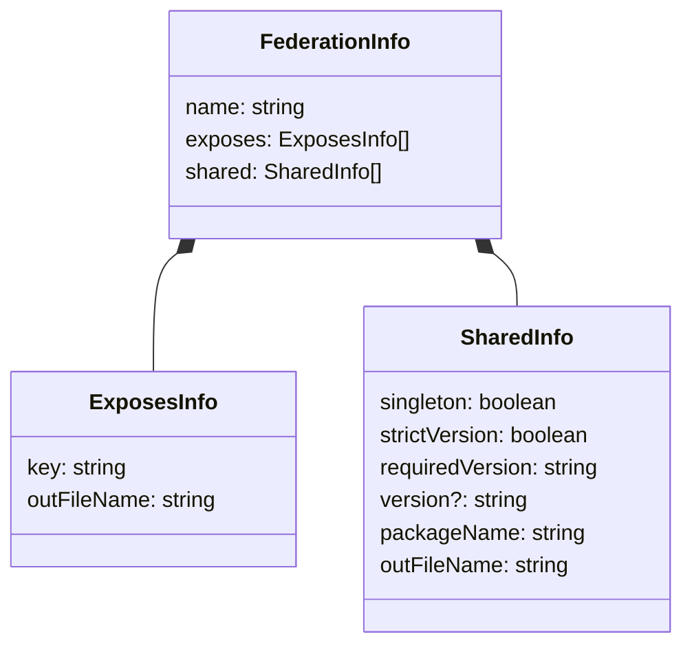

# RemoteEntry.json

The RemoteEntry.json is a remote's metadata file. It is fetched by the native-federation adapter and processed to be stored in cache. 

## Aggregates

```mermaid
classDiagram
    FederationInfo *-- ExposesInfo
    FederationInfo *-- SharedInfo

    class FederationInfo {
        name: string
        exposes: ExposesInfo[]
        shared: SharedInfo[]
    }
    class ExposesInfo{
        key: string
        outFileName: string
    }
    class SharedInfo{
        singleton: boolean
        strictVersion: boolean
        requiredVersion: string
        version?: string
        packageName: string
        outFileName: string
    }
```