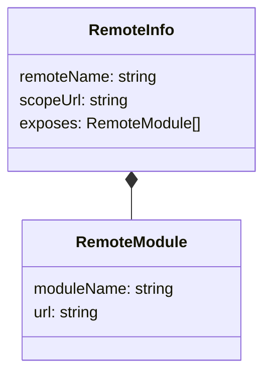

# RemoteInfo

The RemoteInfo is the object that defines the remote combined with its exposed modules. 

## Aggregates

```mermaid
classDiagram
    RemoteInfo *-- RemoteModule

    class RemoteInfo {
        remoteName: string
        scopeUrl: string
        exposes: RemoteModule[] 
    }
    class RemoteModule{
        moduleName: string
        url: string
    }

```