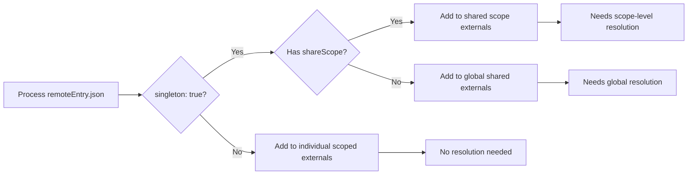
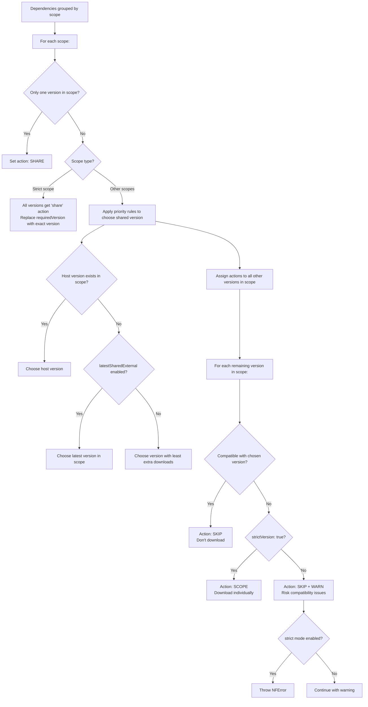
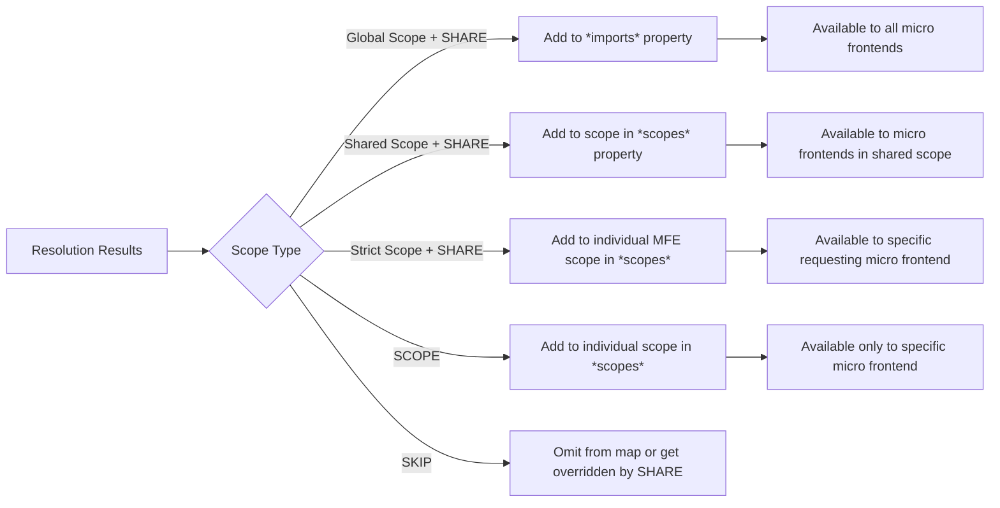
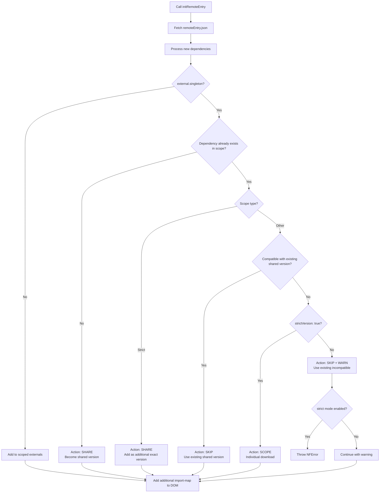
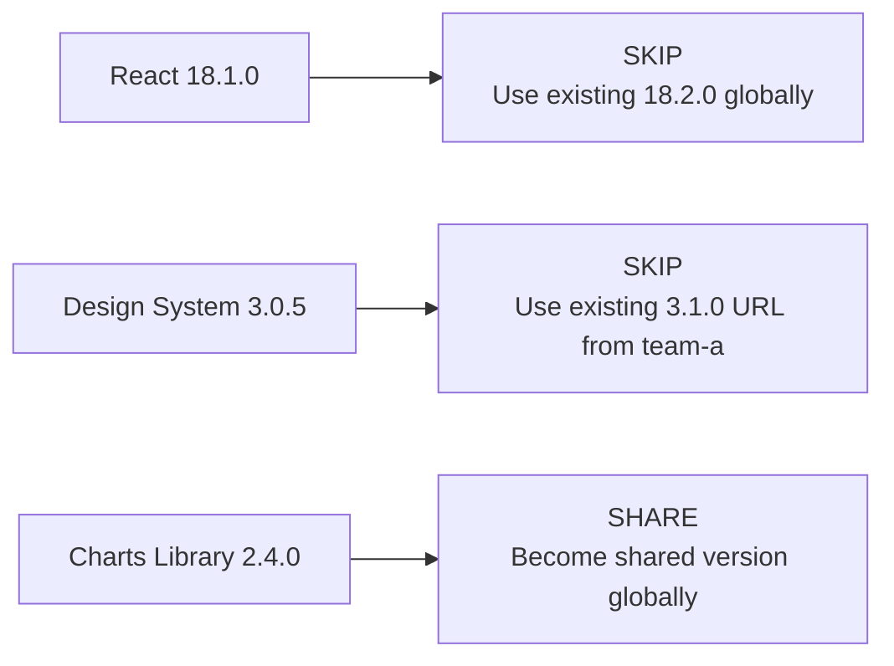
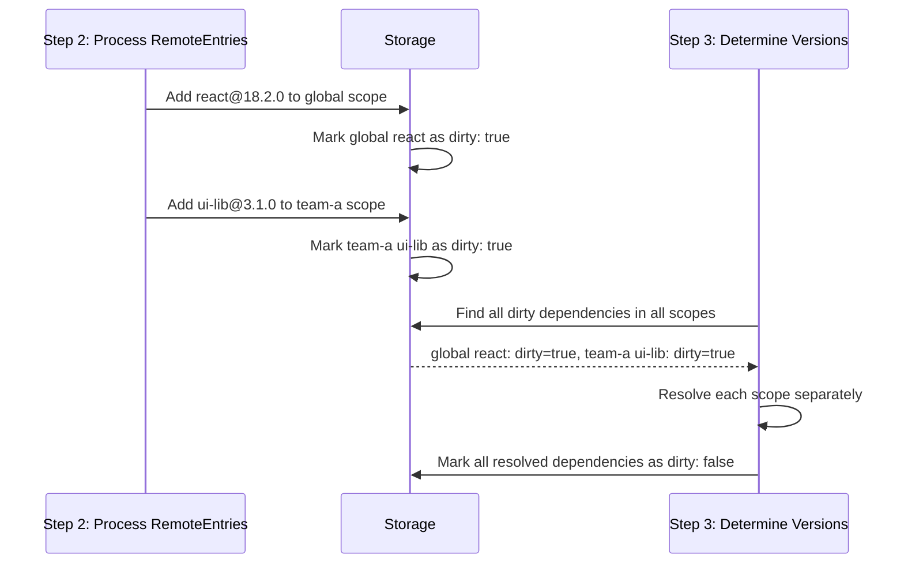
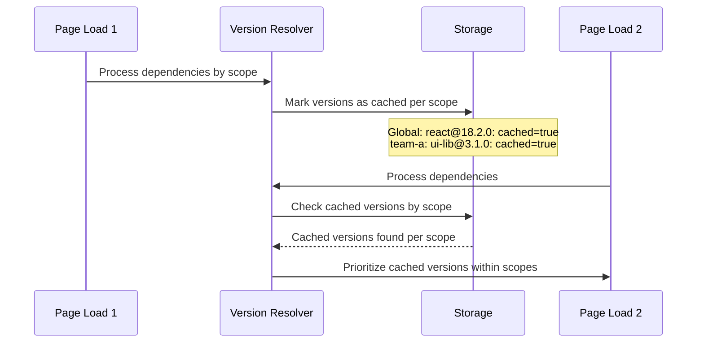

[< back](./../README.md)

# Version Resolver

The version resolver determines how to handle dependencies when multiple micro frontends need the same externals (dependencies). It decides which dependency versions to share globally, share within specific scopes, or scope to individual remotes (micro frontends).

## Understanding Import Maps

The version resolver creates an import map from the provided remote metadata files (remoteEntry.json). Dependencies (externals) can be shared globally, shared within specific groups (shared scopes), or scoped to individual micro frontends.

### What is an Import Map?

An [import map](https://developer.mozilla.org/en-US/docs/Web/HTML/Reference/Elements/script/type/importmap) is a JSON structure that tells the browser where to find JavaScript modules:

```javascript
{
  "imports": {
    "react": "https://cdn.example.com/react@18.2.0.js",
    "lodash": "https://cdn.example.com/lodash@4.17.21.js"
  },
  "scopes": {
    "https://legacy-mfe.example.com/": {
      "react": "https://legacy-mfe.example.com/react@17.0.2.js"
    }
  }
}
```

When your code does `import React from 'react'`, the browser uses this map to fetch the actual file.

### Only one shared version per scope

**Critical constraint**: Import maps can only specify **one version** of each dependency per scope:

```javascript
// ❌ This is NOT possible in import maps
{
  "imports": {
    "react": "https://cdn.example.com/react@18.2.0.js",
    "react": "https://cdn.example.com/react@17.0.2.js"  // Duplicate key!
  }
}
```

This limitation necessitates version resolution. When multiple micro frontends require different versions of the same dependency within a scope, only one can be shared.

### The Solution: Multiple Scope Levels

Import maps provide **scopes** and **shared scopes** as solutions for dependency management:

```javascript
{
  "imports": {
    // Global scope - most micro frontends use this
    "react": "https://cdn.example.com/react@18.2.0.js",
    "ui-library": "https://cdn.example.com/ui-lib@2.1.0.js"
  },
  "scopes": {
    // Individual micro frontend scope
    "https://legacy-mfe.example.com/": {
      "react": "https://legacy-mfe.example.com/react@17.0.2.js"
    },

    // Linking multiple scopes to the same external can create a more fine-grained sharing of externals between a specific selection of remotes.
    "mfe1.example.com/": {
      "ui-library": "mfe1.example.com/ui-lib@3.0.0.js"
    },
    "mfe2.example.com/": {
      "ui-library": "mfe1.example.com/ui-lib@3.0.0.js"
    }
  }
}
```

**How it works**:

- **Global sharing**: Most micro frontends use React 18.2.0 and UI Library 2.1.0
- **Individual scoping**: Legacy MFE gets its own React 17.0.2
- **shareScope grouping**: Design system MFEs share UI Library 3.0.0.

**Specificity**:

The order of precedence is based on the specificity of the scope, with the global import having the lowest precedence.

## Shared vs Scoped Dependencies

In the micro-frontend's metadata file (remoteEntry.json), dependencies are marked as "externals". Every external contains configuration that determines how it should be shared.

### Shared externals (singleton: true)

Dependencies marked as `singleton: true` are candidates for sharing:

```json
// In remoteEntry.json
{
  "shared": [
    {
      "packageName": "react",
      "singleton": true,
      "version": "18.2.0",
      "requiredVersion": "^18.0.0"
    }
  ]
}
```

**Result**: This dependency is a candidate to be placed in the imports object (in the importmap).

### Scoped externals (singleton: false)

Dependencies with `singleton: false` are always scoped to their individual remote:

```json
// In remoteEntry.json
{
  "shared": [
    {
      "packageName": "lodash-utils",
      "singleton": false,
      "version": "1.0.0"
    }
  ]
}
```

**Result**: This external is placed in the scope of its remote. And therefore only available to that specific remote.

### Shared scopes

By default, dependencies with the `singleton: true` property are shared globally between all remotes. The `shareScope` property can be used for externals that should only be shared over a select group of remotes. The `shareScope` property creates a logical group for dependency resolution. Externals with the same shared scope are resolved together in isolation from other share scopes.

This can be useful e.g. if some legacy remotes are still dependent on a previous major of a framework:

> Internally, shared "scope groups" don't exist in import maps, therefore it is only possible through overriding the specific scopes with 'the same url'.

```json
// Team A micro frontends - share UI components v3.x
{
  "shared": [{
    "packageName": "ui-components",
    "singleton": true,
    "shareScope": "team-a",
    "version": "3.1.0",
    "requiredVersion": "^3.0.0"
  }]
}

// Team B micro frontends - share UI components v2.x
{
  "shared": [{
    "packageName": "ui-components",
    "singleton": true,
    "shareScope": "team-b",
    "version": "2.5.0",
    "requiredVersion": "^2.0.0"
  }]
}

// Global shared dependency
{
  "shared": [{
    "packageName": "react",
    "singleton": true,
    "version": "18.2.0",
    "requiredVersion": "^18.0.0"
  }]
}
```

**How shared scopes work:**

1. **Resolution**: Dependencies with the same `shareScope` are grouped and resolved together
2. **Sharing**: The version within a logical group that is deemed to be most optimal for sharing is shared among all micro frontends in that logical group
3. **Import Map**: Each micro frontend within the logical group gets the shared version added to its individual scope in the final import map

### The "strict" shareScope

The special `shareScope: "strict"` shareScope enables exact version matching instead of semantic version range compatibility. This is useful when you need precise version control and want to share multiple specific versions of the same dependency.

```json
// Strict sharing - only exact versions are matched
{
  "shared": [
    {
      "packageName": "ui-library",
      "singleton": true,
      "shareScope": "strict",
      "version": "2.1.1",
      "requiredVersion": "^2.1.0" // Will be replaced with exact version 2.1.1
    }
  ]
}
```

**Differences compared to regular "share scopes":**

While a regular shareScope (including "global") shares only the most compatible version and scopes the rest of the provided incompatible versions. The "strict" shareScope will share _all_ provided versions. The shared versions will be stripped of their requiredVersion range and exposed as exact versions. This way, remotes can still share dependencies while receiving their own exact provided version. This is good for externals that have many breaking updates or incompatibilities between (patch) versions.

**Example: Multiple exact versions sharing**

```json
// Team A - Angular 15.2.1
{
  "shared": [{
    "packageName": "@angular/core",
    "singleton": true,
    "shareScope": "strict",
    "version": "15.2.1",
    "requiredVersion": "15.2.1"  // Exact version required
  }]
}

// Team B - Angular 15.2.3
{
  "shared": [{
    "packageName": "@angular/core",
    "singleton": true,
    "shareScope": "strict",
    "version": "15.2.3",
    "requiredVersion": "15.2.3"  // Different patch, potential incompatibility
  }]
}

// Result: Both teams get their exact Angular version
// No runtime compatibility issues from mismatched compiled code
```

This prevents the runtime errors that occur when Angular's AOT-compiled code expects specific internal APIs that may have changed between patch versions.

**When to use strict shareScope:**

- **Compiled Frameworks**: @angular/\* related packages, where patch versions can break compatibility due to AOT compilation
- **Breaking Changes**: When minor/patch versions introduce breaking changes despite semantic versioning
- **Multiple Teams**: Teams needing different exact versions of shared libraries
- **Legacy Support**: Supporting specific legacy versions alongside newer ones
- **API Contracts**: When exact version matching is required for API compatibility

**Limitations:**

- No automatic version resolution - each MFE gets exactly what it specifies
- Potential for more downloads compared to compatible version ranges
- Requires careful coordination between teams, especially when using angular modules as remote modules. This feature does not fix an incompatibility between remotes.

## Resolution Process

The resolver creates an import map based on the provided metadata (remoteEntry.json) files, processing dependencies at multiple scope levels.

### Step 1: Categorize Dependencies by Scope



### Step 2: Resolve Dependencies by Scope

Dependencies are resolved separately for each scope:

```
// Input: Multiple scopes with different versions

Global scope:
  react@18.2.0 (requires "^18.0.0", singleton: true)
  react@18.1.0 (requires "^18.0.0", singleton: true)

"team-a" scope:
  ui-lib@3.1.0 (requires "^3.0.0", singleton: true, shareScope: "team-a")
  ui-lib@3.0.5 (requires "^3.0.0", singleton: true, shareScope: "team-a")

"team-b" scope:
  ui-lib@2.5.0 (requires "^2.0.0", singleton: true, shareScope: "team-b")

"strict" scope:
  design-tokens@2.1.0 (requires "2.1.0", singleton: true, shareScope: "strict")
  design-tokens@2.2.0 (requires "2.2.0", singleton: true, shareScope: "strict")

Individual scopes:
  lodash@4.17.21 (singleton: false)
```

### Step 3: Resolution Algorithm

For each scope (global, shared scopes, strict, individual), the resolver determines one or more versions to share:



### Step 4: Generate Import Map

The resolver creates different import map sections based on scope and actions:



## Dynamic Init

> **Important!:** This feature currently only works with the `use-import-shim` import-map type.

Dynamic init is a runtime feature that allows loading additional micro frontends after the initial federation setup is complete. This is useful for lazy-loading micro frontends on demand or adding micro frontends based on user interactions or application state.

### Key Characteristics/limitations

**Additive Only**: Dynamic init can only **add** new dependencies to existing scopes - it cannot replace, modify, or remove dependencies that were resolved during the initial setup.

**Non-Disruptive**: The dynamic init process preserves all existing dependency resolutions and import map entries. Cached dependencies from the initial setup remain unchanged.

**Scope Aware**: Dynamic init respects the same scoping rules as the initial resolution process, adding new dependencies to their appropriate global, shared, or individual scopes.

This is in line with the ideology behind import maps. [source](https://github.com/WICG/import-maps/blob/abc4c6b24e0cc9a764091be916c5057e83c30c23/README.md) | [Shopify article](https://shopify.engineering/resilient-import-maps#)

### How Dynamic Init Works

When you call `initRemoteEntry()` to dynamically load a micro frontend, the system follows these steps:



### Dynamic Init Actions

Each new dependency gets one of these actions during dynamic init:

| Action    | Description                                                                                                                                                                                          |
| --------- | ---------------------------------------------------------------------------------------------------------------------------------------------------------------------------------------------------- |
| **SKIP**  | Version already exists or use existing shared version. In a shareScope context this action is used for overriding by skipping the provided external and loading a compatible cached version instead. |
| **SHARE** | No compatible version exists (yet), become the shared version for this scope                                                                                                                         |
| **SCOPE** | Incompatible version with strictVersion: true                                                                                                                                                        |

### Example: Dynamic Loading Scenario

```javascript
// Initial setup
const { initRemoteEntry } = await initFederation({
  'team/header': 'http://localhost:3000/remoteEntry.json',
  'team/sidebar': 'http://localhost:4000/remoteEntry.json',
});

// Later, dynamically load a new micro frontend
await initRemoteEntry('http://localhost:5000/remoteEntry.json', 'team/dashboard');

// The dashboard MFE becomes available
const DashboardComponent = await loadRemoteModule('team/dashboard', './Dashboard');
```

### Initial Setup Dependencies

```json
// team/header - React 18.2.0 (global scope)
{
  "shared": [{
    "packageName": "react",
    "version": "18.2.0",
    "singleton": true
  }]
}

// team/sidebar - Design System 3.1.0 (team-a scope)
{
  "shared": [{
    "packageName": "design-system",
    "version": "3.1.0",
    "singleton": true,
    "shareScope": "team-a"
  }]
}
```

### Dynamic Init - New Dashboard MFE

```json
// team/dashboard - added dynamically
{
  "shared": [
    {
      "packageName": "react",
      "version": "18.1.0",
      "requiredVersion": "^18.0.0",
      "singleton": true
    },
    {
      "packageName": "design-system",
      "version": "3.0.5",
      "requiredVersion": "^3.0.0",
      "singleton": true,
      "shareScope": "team-a"
    },
    {
      "packageName": "charts-library",
      "version": "2.4.0",
      "singleton": true
    }
  ]
}
```

### Resolution Results



### Resulting Import Map Changes

**Before Dynamic Init:**

```javascript
{
  "imports": {
    "react": "http://localhost:3000/react@18.2.0.js"
  },
  "scopes": {
    "http://localhost:4000/": {
      "design-system": "http://localhost:4000/design-system@3.1.0.js"
    }
  }
}
```

**ImportMap that will be appended to the DOM:**

```javascript

{
  "imports": {
    "charts-library": "http://localhost:5000/charts-library@2.4.0.js"
  },
  "scopes": {
    "http://localhost:5000/": {
      "design-system": "http://localhost:4000/design-system@3.1.0.js"
    }
  }
}
```

### Dynamic Init Constraints

#### Cannot Replace Existing Dependencies

If a dependency is already shared globally during the initial setup, dynamic init cannot replace it with a different version. For example, if React 18.2.0 is shared globally, dynamically loading React 17.0.0 with `strictVersion: false` will still use React 18.2.0 and show a warning. If `strictVersion: true` is used, the micro frontend will get its own scoped copy of React 17.0.0.

#### Cannot Modify Scope Assignments

Dynamic init cannot change the scope of a shared dependency. If a dependency like design-system@3.1.0 is shared in the "team-a" scope, it cannot be moved to the global scope or another shared scope during dynamic loading.

#### Dirty Flag Always False

Dynamic init sets `dirty: false` for all dependencies because it never modifies existing resolutions:

```typescript
// Dynamic init behavior
ports.sharedExternalsRepo.addOrUpdate(packageName, {
  dirty: false, // Always false - no re-resolution needed
  versions: [...existingVersions, newVersion],
});
```

### Best Practices for Dynamic Init

#### 1. Design for Additive Loading

Structure your application so dynamic MFEs complement rather than conflict with initial setup:

```javascript
// ✅ Good: Progressive enhancement
Initial: Core navigation + basic React
Dynamic: Dashboard with charts, analytics widgets

// ❌ Problematic: Conflicting versions
Initial: React 18.x + Modern UI library
Dynamic: Legacy MFE requiring React 17.x + Old UI library
```

#### 2. Use Shared Scopes Strategically

Group related MFEs in shared scopes to maximize reuse during dynamic loading:

```javascript
// ✅ Good: Team-based scopes
"team-dashboard": { "ui-components": "3.x" }
"team-reports": { "ui-components": "3.x" }

// Later dynamic loading within same team reuses components
```

#### 3. Handle Loading Failures Gracefully

```javascript
try {
  await initRemoteEntry('http://dashboard-team.com/remoteEntry.json', 'dashboard');
  // Dashboard is now available
} catch (error) {
  console.warn('Dashboard MFE failed to load:', error);
  // Application continues without dashboard features
}
```

#### 4. Monitor Compatibility Warnings

Dynamic init may produce warnings for version mismatches:

```javascript
// Enable logging to catch compatibility issues
await initFederation(manifest, {
  logLevel: 'warn',
  logger: consoleLogger,
});

// Watch for warnings like:
// "WARN: dashboard.react@18.1.0 using existing shared version 18.2.0"
```

### Use Cases for Dynamic Init

#### Route-Based Loading

```javascript
// Load MFEs based on navigation
router.on('/dashboard', async () => {
  await initRemoteEntry('http://dashboard.com/remoteEntry.json', 'dashboard');
  const Dashboard = await loadRemoteModule('dashboard', './Dashboard');
});
```

#### Feature Flags

```javascript
// Load additional features based on user permissions
if (user.hasFeature('advanced-analytics')) {
  await initRemoteEntry('http://analytics.com/remoteEntry.json', 'analytics');
}
```

#### A/B Testing

```javascript
// Load different versions for testing
const variant = getABTestVariant();
await initRemoteEntry(`http://variant-${variant}.com/remoteEntry.json`, 'test-mfe');
```

## Understanding Scope Levels

### Global Scope (`__GLOBAL__`)

- **Purpose**: Dependencies shared across all micro frontends
- **Use case**: Core libraries like React, common utilities
- **Configuration**: `singleton: true` without `shareScope`
- **Import map**: Added to the `imports` property

### Shared Scopes (custom names)

- **Purpose**: Logical groupings for dependency resolution among specific micro frontends
- **Use case**: Team-specific libraries, design systems, domain-specific tools
- **Configuration**: `singleton: true` with `shareScope: "scope-name"`
- **Import map**: Resolved version URL is added to each MFE's individual scope

### Strict Scope (`"strict"`)

- **Purpose**: Exact version matching without semantic version compatibility checking
- **Use case**: Multiple exact versions of the same dependency, legacy support, breaking changes
- **Configuration**: `singleton: true` with `shareScope: "strict"`
- **Import map**: Each exact version URL is added to requesting MFE's individual scope
- **Unique behavior**: Multiple versions can have the "share" action simultaneously

### Individual Scopes (per micro frontend)

- **Purpose**: Dependencies used only by one micro frontend
- **Use case**: Incompatible versions, micro frontend-specific libraries
- **Configuration**: `singleton: false` or incompatible shared dependencies
- **Import map**: Added to the specific MFE's scope with its own URL

## Understanding "dirty" Flag

When processing remoteEntry.json files, shared dependencies are marked as "dirty" when new versions are added or their version list changes. This signals that the dependency needs resolution within its scope.



**Why this matters**: The dirty flag prevents unnecessary re-resolution of dependencies that haven't changed within their scope, improving performance when the same micro frontends are loaded repeatedly.

## Understanding "strictVersion"

The `strictVersion` flag applies to shared dependencies (`singleton: true`) and determines how incompatible versions are handled within each scope:

### strictVersion: false (default)

The user will be notified about the incompatible version, but the resolver will skip this version since another version was already shared in the scope.

```json
// MFE needs ui-lib ~4.16.0, but team-a scope shares 4.17.0
{
  "packageName": "ui-lib",
  "version": "4.16.5",
  "requiredVersion": "~4.16.0",
  "singleton": true,
  "shareScope": "team-a",
  "strictVersion": false
}

// Result: SKIP + WARNING
// The MFE will use the shared 4.17.0 version URL from team-a scope
// May cause runtime compatibility issues
```

### strictVersion: true

```json
// MFE needs ui-lib ~4.16.0, but team-a scope shares 4.17.0
{
  "packageName": "ui-lib",
  "version": "4.16.5",
  "requiredVersion": "~4.16.0",
  "singleton": true,
  "shareScope": "team-a",
  "strictVersion": true
}

// Result: SCOPE (individual)
// The MFE gets its own ui-lib@4.16.5 download
// Guaranteed compatibility, but extra download
```

**Note**: `strictVersion` is ignored for scoped dependencies (`singleton: false`) since they always get their own copy.

## Priority Rules Explained

### 1. Host Version Override

Host remoteEntry.json has the highest precedence within each scope. When an external version exists in the host remoteEntry.json for a specific scope, it is guaranteed chosen as the shared version for that scope.

```javascript
await initFederation(manifest, {
  hostRemoteEntry: { url: './host-remoteEntry.json' },
});

// If host specifies react@18.0.5 globally, it wins over:
// - MFE1's react@18.2.0 (global)
// - MFE2's react@18.1.0 (global)

// If host specifies ui-lib@3.0.0 for team-a scope, it wins over:
// - Team A MFE1's ui-lib@3.1.0 (team-a scope)
// - Team A MFE2's ui-lib@3.0.5 (team-a scope)
```

### 2. Latest Version Strategy

Can be activated with the `profile.latestSharedExternal` hyperparameter. This changes the strategy within each scope from "most optimal" to "latest available" version.

```javascript
await initFederation(manifest, {
  profile: { latestSharedExternal: true },
});

// Available versions in global scope: [18.1.0, 18.2.0, 18.0.5]
// Chosen: 18.2.0 (latest in global scope)

// Available versions in team-a scope: [3.0.5, 3.1.0, 3.0.8]
// Chosen: 3.1.0 (latest in team-a scope)
```

### 3. Optimal Version Strategy (default)

**Why this is default**: Minimizes bundle size and download time by choosing the version that requires the fewest additional scoped downloads within each scope.

The resolver calculates which version minimizes extra downloads per scope by examining how many versions would need to be individually scoped due to incompatibility:

```
// The resolver calculates which version minimizes extra downloads per scope:

Global scope - if 18.2.0 is chosen:
  18.1.0: compatible (SKIP) → 0 extra downloads
  17.0.2: incompatible + strict (SCOPE) → 1 extra download
  Total cost: 1 extra download

Team-a scope - if 3.1.0 is chosen:
  3.0.5: compatible (SKIP) → 0 extra downloads
  Total cost: 0 extra downloads

Result: Choose 18.2.0 globally, 3.1.0 for team-a scope
```

### 4. Caching Strategy

The resolver optimizes for applications with page reloads. When storage like sessionStorage is chosen, shared dependencies are cached across page loads within their respective scopes:



## Remote Cache Override Behavior

When a remote is already present in the cache, the orchestrator will skip the requested remote or override the existing cached remote based on the provided `profile` options.

### Override Flag Detection

The orchestrator checks when a remote should be overridden or skipped by comparing the provided remoteName with the cached remoteName. If they match, the requested `remoteEntry.json` URL will be compared with the cached `remoteEntry.json` URL. By default, on initialization, the remote will be skipped if the URLs match and overridden if the URLs differ. Except for the dynamic init which will always skip by default.

### Skip Cached Remotes Configuration

The `overrideCachedRemotes` setting controls whether to fetch remotes that already exist in cache. The default setting is "init-only" since it is generally not recommended to update the existing import-map after initialization:

```javascript
await initFederation(manifest, {
  profile: {
    overrideCachedRemotes: 'never', // Do not override cached remotes
    overrideCachedRemotes: 'init-only', // Override only during the first initialization (default)
    overrideCachedRemotes: 'always', // Override all cached remotes
  },
});
```

### URL Matching Behavior

The `overrideCachedRemotesIfURLMatches` setting provides additional control. Normally, it makes sense to only override the cached remote if the URL changed, like from `https://my.cdn/mfe1/0.0.1/remoteEntry.json` to `https://my.cdn/mfe1/0.0.2/remoteEntry.json`. However, it might be necessary to always override, even if the URL matches the previously cached url:

```javascript
await initFederation(manifest, {
  profile: {
    overrideCachedRemotes: 'always',
    overrideCachedRemotesIfURLMatches: true,
  },
});
```

> **Note:** the `overrideCachedRemotes` is generally meant as "override only if urls differ".

### Override Processing Steps

When a remote is marked for override by the orchestrator (`override: true`), the system performs complete cache cleanup by purging all cached meta data like exposed modules and externals:

```mermaid
flowchart TD
    A[Remote marked as override] --> B[Remove from RemoteInfo cache]
    B --> C[Remove from ScopedExternals cache]
    C --> D[Remove from SharedExternals cache (all scopes)]
    D --> E[Add new RemoteInfo to cache]
    E --> F[Process new externals normally]

    F --> G{External Type}
    G -->|singleton: true| H[Add to SharedExternals]
    G -->|singleton: false| I[Add to ScopedExternals]
```

## Configuration

### Host Remote Entry

Specify a host `remoteEntry.json` to control critical dependencies across all scopes:

```javascript
await initFederation(manifest, {
  hostRemoteEntry: {
    url: './host-remoteEntry.json',
  },
});
```

Host dependencies can specify `shareScope` to control specific logical shared scopes, or omit it to control global sharing. Host versions always take precedence within their respective scope.

### Resolution Strategy

Hyperparameters to tweak the behavior of the version resolver across all scopes:

```javascript
await initFederation(manifest, {
  // Use latest available versions in each scope
  profile: {
    latestSharedExternal: true,
  },

  // Skip cached remotes for performance
  profile: {
    overrideCachedRemotes: 'never',
  },

  // Fail on version conflicts in any scope
  strict: true,
});
```

### Storage Options

Choosing different storage allows the library to reuse cached externals across page loads, maintaining scope-specific optimizations:

```javascript
// In-memory only (default) - fastest, lost on page reload
storage: globalThisStorageEntry,

// Single session only - survives page reloads, cleared when browser closes
storage: sessionStorageEntry,

// Persist across browser sessions - survives browser restarts
storage: localStorageEntry
```

**When to use each**:

- **globalThis**: Development or single-page visits where speed matters most
- **sessionStorage**: Multi-page applications where users navigate between pages
- **localStorage**: Frequently visited applications where long-term caching provides value

**Scope impact**: All storage options maintain the logical shared scope groupings and resolved version URLs for optimal performance.

## Troubleshooting

### Version Conflicts

```
// Error in strict mode for global scope
NFError: [team/mfe1] dep-a@1.2.3 is not compatible with existing dep-a@2.0.0 requiredRange '^1.0.0'

// Error in strict mode for shared scope
NFError: [custom-scope.dep-a] ShareScope external has multiple shared versions.

// Solutions:
// 1. Loosen the version constraints in the remoteEntry.json
// 2. Use host override for the dependency in the specific scope
// 3. Disable strict mode
// 4. Move conflicting dependencies to different shared scopes
// 5. Use strict shareScope for exact version control
```

### Shared Scope Issues

```
// Warning for shared scope with no shared versions
Warning: [team-a][dep-a] shareScope has no override version.

// All versions in the shared scope will be individually scoped
// Consider reviewing version compatibility or shared scope assignments
```

**Common causes**:

- All versions in the logical shared scope are incompatible with each other and have `strictVersion: true`
- Misconfigured shared scope names leading to single-version groups
- Version ranges that don't overlap within the logical group

### Strict Scope Considerations

```
// Multiple exact versions in strict scope
Info: Strict scope external design-tokens has multiple shared versions: 2.1.0, 2.2.0

// This is expected behavior - each exact version gets its own download
// Consider if version consolidation is possible to reduce bundle size
```

**Best practices for strict scopes**:

- Use sparingly to avoid version sprawl
- Consider if regular shareScopes with looser version ranges could work
- Document exact version requirements clearly for your team
- Monitor bundle size impact of multiple exact versions

**Common scenarios requiring strict scopes**:

- **Angular applications**: Patch versions can break compatibility due to AOT compilation
- **Compiled frameworks**: Any framework with compilation steps that create version-specific artifacts
- **Binary dependencies**: Native modules or WebAssembly that require exact version matching
- **Legacy migrations**: Gradually migrating from old to new versions without compatibility risks

## Semver Compatibility

The resolver uses [standard semantic versioning rules](https://www.npmjs.com/package/semver) within each scope:

| Range     | Matches               | Examples                  |
| --------- | --------------------- | ------------------------- |
| `^1.2.3`  | Compatible changes    | `1.2.4`, `1.3.0`, `1.9.9` |
| `~1.2.3`  | Patch-level changes   | `1.2.4`, `1.2.9`          |
| `>=1.2.3` | Greater than or equal | `1.2.3`, `2.0.0`          |
| `1.2.3`   | Exact version         | `1.2.3` only              |

Pre-release versions are only compatible with the same pre-release range within the same scope.
