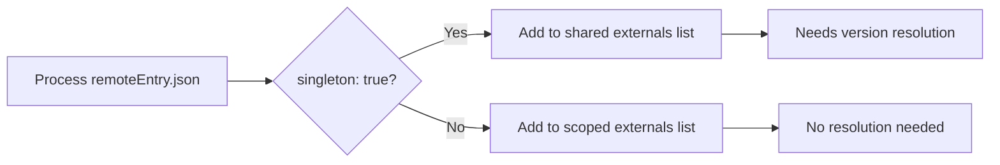
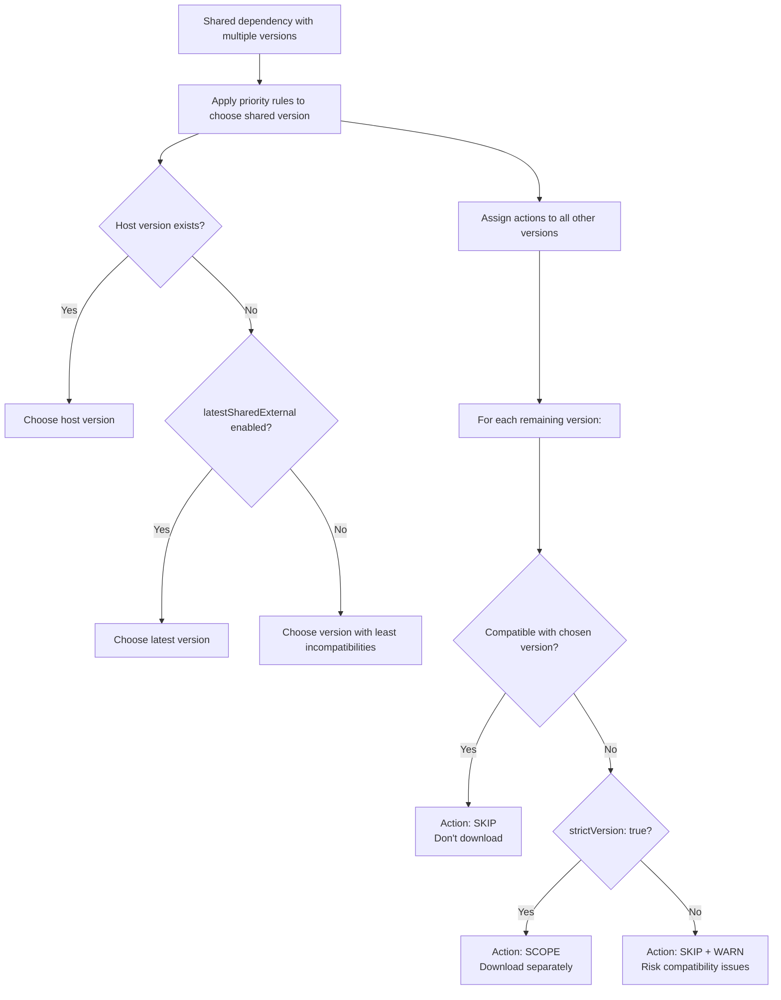
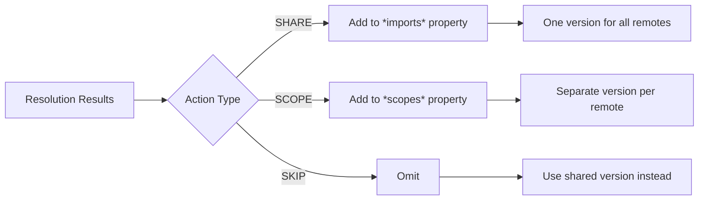
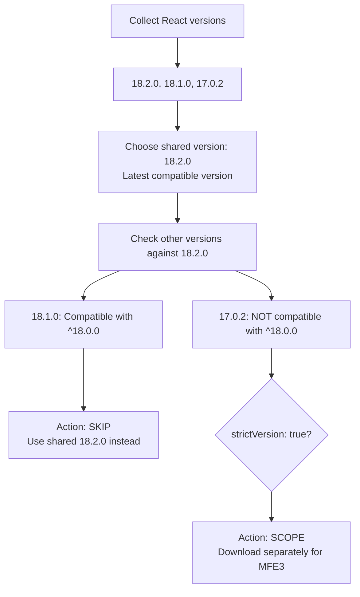
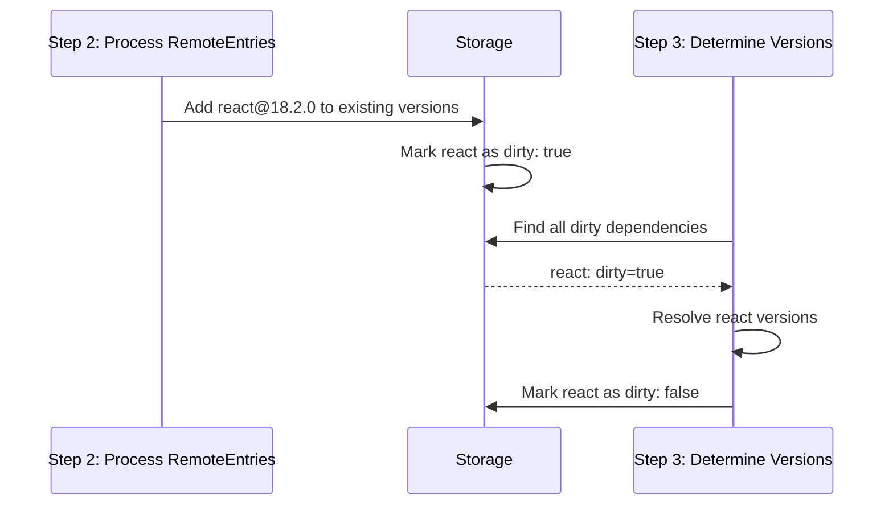
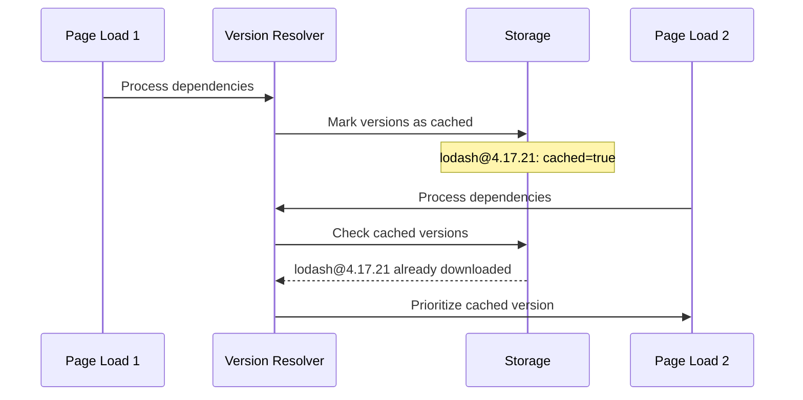

[< back](./../README.md)

# Version Resolver

The version resolver determines how to handle dependencies when multiple micro frontends need the same externals (dependencies). It decides which dependency versions to share globally versus scope to specific remotes (micro frontends). 

## Understanding Import Maps

The version resolver will create an importmap from the provided remote metadata files (remoteEntry.json), dependencies (externals) can be shared with other remotes or scoped and thus only available for the exposed modules in that particular remote. 

### What is an Import Map?

An [import map](https://developer.mozilla.org/en-US/docs/Web/HTML/Reference/Elements/script/type/importmap) is a JSON structure that tells the browser where to find JavaScript modules:

```javascript
{
  "imports": {
    "react": "https://cdn.example.com/react@18.2.0.js",
    "lodash": "https://cdn.example.com/lodash@4.17.21.js"
  }
}
```

When your code does `import React from 'react'`, the browser uses this map to fetch the actual file.

### Only one globally shared version

**Critical constraint**: Import maps don't understand the concept of versioning, therefore, it can only specify **one global version** of each dependency:

```javascript
// ❌ This is NOT possible in import maps
{
  "imports": {
    "react": "https://cdn.example.com/react@18.2.0.js",
    "react": "https://cdn.example.com/react@17.0.2.js"  // Duplicate key!
  }
}
```

This limitation is a version resolver is necessary. When multiple micro frontends require different versions of the same dependency, only one can be imported.

### The Solution: Scopes

Import maps provide **scopes** as a workaround for incompatible versions:

```javascript
{
  "imports": {
    // Global default - most micro frontends use this
    "react": "https://cdn.example.com/react@18.2.0.js"
  },
  "scopes": {
    // Exception for legacy micro frontend
    "https://legacy-mfe.example.com/": {
      "react": "https://legacy-mfe.example.com/react@17.0.2.js"
    }
  }
}
```

**How it works**:
- When MFE1 or MFE2 imports React → gets version 18.2.0 (global)
- When legacy-mfe imports React → gets version 17.0.2 (scoped)

**The trade-off**: Scoped dependencies require separate downloads, increasing bundle size. This because 2 versions of the external are being downloaded. 

## Shared vs Scoped Dependencies

In the micro-frontend's metadata file (remoteEntry.json), dependencies are marked as "externals". Every external contains a `version` property (the version of the external) and a `requiredVersion` property (the versions of the external that this particular remote is compatible with).

### Shared externals (singleton: true)
Dependencies marked as `singleton: true` in remoteEntry.json are candidates for global sharing:

```javascript
// In remoteEntry.json
{
  "shared": [{
    "packageName": "react",
    "singleton": true,        // ← Marked as globally shared
    "version": "18.2.0",
    "requiredVersion": "^18.0.0"
  }]
}
```

**Result**: Only one version downloads globally, used by all **compatible** micro frontends.

### Scoped externals (singleton: false)
Dependencies with `singleton: false` are always scoped to their remote:

```javascript
// In remoteEntry.json  
{
  "shared": [{
    "packageName": "lodash-utils",
    "singleton": false,       // ← Always scoped
    "version": "1.0.0"
  }]
}
```

**Result**: Each micro frontend gets its own copy, no sharing occurs.

## Resolution Process

The resolver creates an import-map based on the provided metadata (remoteEntry.json) files. It needs to process which dependencies can be shared and which have to be scoped.

### Step 1: Categorize Dependencies



### Step 2: Resolve Shared Dependencies

Only shared dependencies (`singleton: true`) go through version resolution:

```javascript
// Input: Multiple micro frontends need React
MFE1: react@18.2.0 (requires "^18.0.0", singleton: true)
MFE2: react@18.1.0 (requires "^18.0.0", singleton: true) 
MFE3: react@17.0.2 (requires "^17.0.0", singleton: true, strictVersion: true)
```

### Step 3: Resolution Algorithm

For each shared dependency, the resolver determines one version to share globally:



### Step 4: Generate Import Map

The resolver creates different import map sections based on the actions:



## Complete Example: React Resolution

### Input: Three Micro Frontends

```javascript
// MFE1's remoteEntry.json
{
  "shared": [{
    "packageName": "react",
    "version": "18.2.0",
    "requiredVersion": "^18.0.0",
    "singleton": true,
    "strictVersion": false
  }]
}

// MFE2's remoteEntry.json  
{
  "shared": [{
    "packageName": "react", 
    "version": "18.1.0",
    "requiredVersion": "^18.0.0", 
    "singleton": true,
    "strictVersion": false
  }]
}

// MFE3's remoteEntry.json
{
  "shared": [{
    "packageName": "react",
    "version": "17.0.2", 
    "requiredVersion": "^17.0.0",
    "singleton": true,
    "strictVersion": true  // ← Must have exact compatibility
  }]
}
```

### Resolution Process



### Output Import Map

```javascript
{
  "imports": {
    // Shared globally - MFE1 and MFE2 use this
    "react": "https://mfe1.example.com/react@18.2.0.js"
  },
  "scopes": {
    // Scoped to MFE3 only
    "https://mfe3.example.com/": {
      "react": "https://mfe3.example.com/react@17.0.2.js"  
    }
  }
}
```

### What Actually Downloads

- **react@18.2.0**: Downloaded once, used by MFE1 and MFE2
- **react@18.1.0**: Not downloaded (skipped, compatible with 18.2.0)  
- **react@17.0.2**: Downloaded separately for MFE3 (incompatible, strict)

## Understanding "dirty"

When processing remoteEntry.json files, shared dependencies are marked as "dirty" in storage when new versions are added or when their version list changes. This signals that the dependency needs resolution.



**Why this matters**: The dirty flag prevents unnecessary re-resolution of dependencies that haven't changed, improving performance when the same micro frontends are loaded repeatedly.

## Understanding "strictVersion"

The `strictVersion` flag **only applies to shared dependencies** (`singleton: true`) and determines how incompatible versions are handled:

### strictVersion: false (default)

The user will be notified about the incompatible version that is loaded, but since the user disabled strict version, the resolver will skip this version since another version was already shared.

```javascript
// MFE needs lodash ~4.16.0, but shared version is 4.17.0
{
  "packageName": "lodash",
  "version": "4.16.5", 
  "requiredVersion": "~4.16.0",    // ← Only allows 4.16.x versions
  "singleton": true,
  "strictVersion": false
}

// Result: SKIP + WARNING  
// The MFE will use the shared 4.17.0 version
// May cause runtime compatibility issues
```

### strictVersion: true
```javascript
// MFE needs lodash ~4.16.0, but shared version is 4.17.0  
{
  "packageName": "lodash",
  "version": "4.16.5",
  "requiredVersion": "~4.16.0",    // ← Only allows 4.16.x versions 
  "singleton": true
  "strictVersion": true
}

// Result: SCOPE
// The MFE gets its own lodash@4.16.5 download  
// Guaranteed compatibility, but extra download
```

**Note**: `strictVersion` is ignored for scoped dependencies (`singleton: false`) since they always get their own copy.

## Priority Rules Explained

### 1. Host Version Override

To allow the user to steer which version will be used of a shared external, the host remoteEntry.json has the highest precedence. When an external version exists in the host remoteEntry.json, it is guaranteed chosen as globally shared version.

```javascript
await initFederation(manifest, {
  hostRemoteEntry: { url: "./host-remoteEntry.json" }
});

// If host specifies react@18.0.5, it wins over:
// - MFE1's react@18.2.0
// - MFE2's react@18.1.0
// All other versions are evaluated against the host version
```

### 2. Latest Version Strategy

Can be activated optionally with the `profile.latestSharedExternal` hyperparameter. This changes the strategy of the version resolver from "most optimal" to "latest available" version

```javascript
await initFederation(manifest, {
  profile: { latestSharedExternal: true }
});

// Available versions: [18.1.0, 18.2.0, 18.0.5]
// Chosen: 18.2.0 (latest, regardless of compatibility)
```

### 3. Optimal Version Strategy (default)

**Why this is default**: Minimizes bundle size and download time by choosing the version that requires the fewest additional scoped downloads.

```javascript
// The resolver calculates which version minimizes extra downloads:

// If 18.2.0 is chosen:
// - 18.1.0: compatible (SKIP) → 0 extra downloads
// - 17.0.2: incompatible + strict (SCOPE) → 1 extra download
// Total cost: 1 extra download

// If 17.0.2 is chosen:  
// - 18.2.0: incompatible + strict (SCOPE) → 1 extra download
// - 18.1.0: incompatible + strict (SCOPE) → 1 extra download  
// Total cost: 2 extra downloads

// Result: Choose 18.2.0 (lower cost)
```

### Caching Strategy

The resolver optimizes for applications with page reloads. As visible, when a storage like sessionStorage is chosen, the shared dependencies are passed onto the next page. This way they can be reused to minimize downloads on consecutive pages:



## Configuration

### Host Remote Entry

Specify a host `remoteEntry.json` to control critical dependencies:

```javascript
await initFederation(manifest, {
  hostRemoteEntry: {
    url: "./host-remoteEntry.json"
  }
});
```

### Resolution Strategy

Hyperparameters to tweak the behavior of the version resolver. 

```javascript
await initFederation(manifest, {
  // Use latest available versions
  profile: { 
    latestSharedExternal: true 
  },
  
  // Skip cached remotes for performance
  profile: { 
    skipCachedRemotes: true 
  },
  
  // Fail on version conflicts
  strict: true
});
```

### Storage Options

Choosing a different storage allows the library to reuse the cached externals over different page loads. 

```javascript
// In-memory only (default) - fastest, lost on page reload
storage: config.globalThisStorageEntry,

// Single session only - survives page reloads, cleared when browser closes  
storage: config.sessionStorageEntry,

// Persist across browser sessions - survives browser restarts
storage: config.localStorageEntry
```

**When to use each**:
- **globalThis**: Development or single-page visits where speed matters most
- **sessionStorage**: Multi-page applications where users navigate between pages
- **localStorage**: Frequently visited applications where long-term caching provides value

## Troubleshooting

### Version Conflicts

```javascript
// Error in strict mode
NFError: [dep-a] Shared version 2.0.0 is not compatible with range '^1.0.0'

// Solutions:
// 1. Loosen the version constraints in the remoteEntry.json
// 2. Use host override for the dependency
// 3. Disable strict mode
```

## Semver Compatibility

The resolver uses [standard semantic versioning rules](https://www.npmjs.com/package/semver):

| Range | Matches | Examples |
|-------|---------|----------|
| `^1.2.3` | Compatible changes | `1.2.4`, `1.3.0`, `1.9.9` |
| `~1.2.3` | Patch-level changes | `1.2.4`, `1.2.9` |
| `>=1.2.3` | Greater than or equal | `1.2.3`, `2.0.0` |
| `1.2.3` | Exact version | `1.2.3` only |

Pre-release versions are only compatible with the same pre-release range.